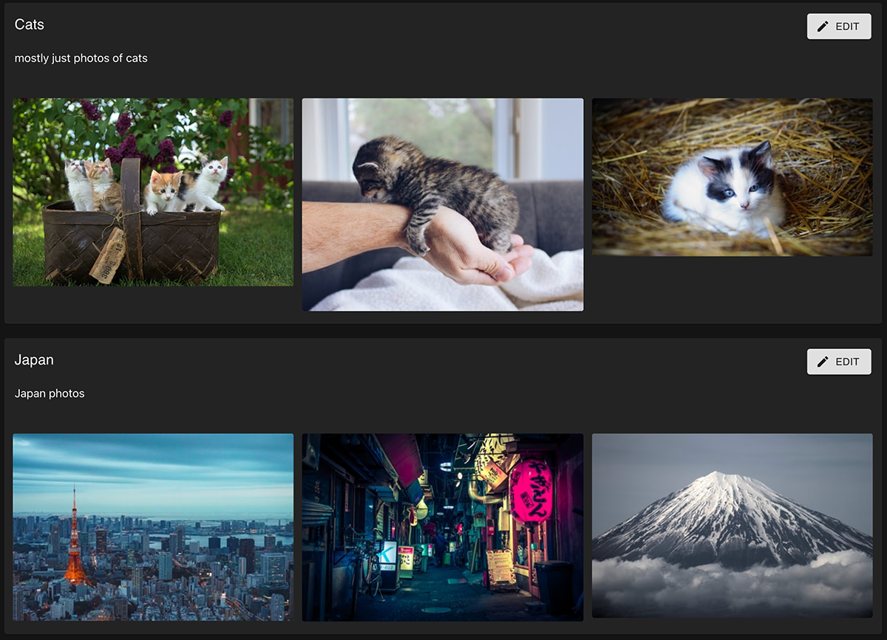

# favorites feature

The **'favorites'** feature manages and promotes the favorites view... a grouping of the user's favorites into separate lists.

Action creators exported by this component's redux slice may be used elsewhere in the application to create lists and add images to lists.

